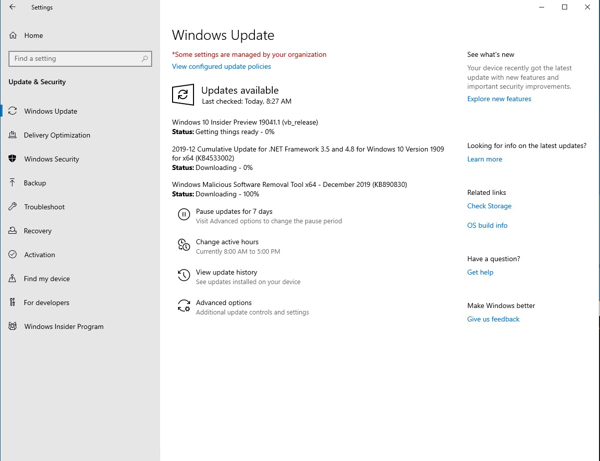
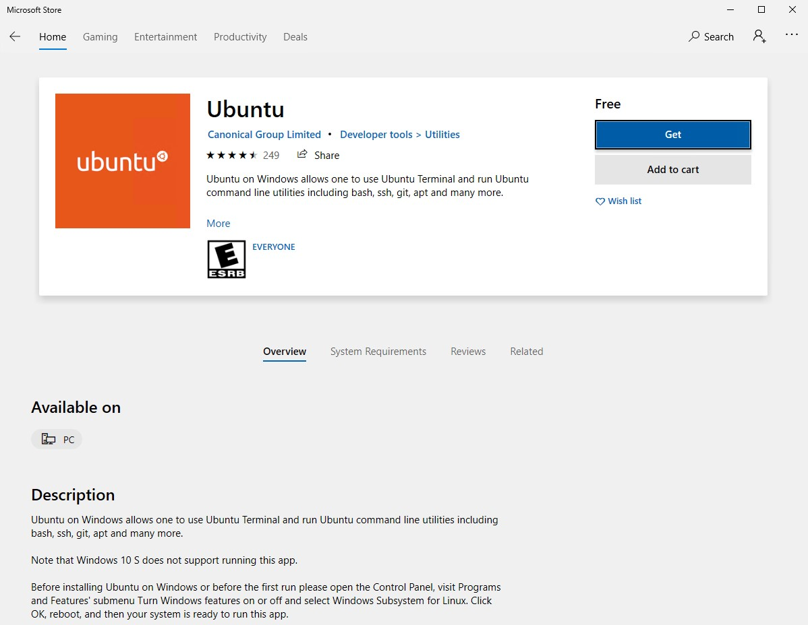

# Azure Terraform Landing Zone Tutorial

## Terraform Tutorial
Create Azure resources using Azure Cloud Shell
1. Create resource group "testResourceGroup"
```
$ export SUBSCRIPTION_ID="xxxxxxxx-xxxx-xxxx-xxxx-xxxxxxxxxxxx"

$ az account set --subscription="${SUBSCRIPTION_ID}"
$ az ad sp create-for-rbac --role="Contributor" --scopes="/subscriptions/${SUBSCRIPTION_ID}"
Creating a role assignment under the scope of "/subscriptions/aaaaaa-bbbb-cccc-dddd-eeeeeeeeeeee"
{
  "appId": "aaaaaa-aaaa-aaaa-aaaa-aaaaaaaaaaaa",
  "displayName": "azure-cli-2019-12-13-08-53-51",
  "name": "http://azure-cli-2019-12-13-08-53-51",
  "password": "bbbbbb-bbbb-bbbb-bbbb-bbbbbbbbbbb",
  "tenant": "cccccccc-cccc-cccc-cccc-cccccccccccc"
}

$ export ARM_SUBSCRIPTION_ID=your_subscription_id
$ export ARM_CLIENT_ID=your_appId
$ export ARM_CLIENT_SECRET=your_password
$ export ARM_TENANT_ID=your_tenant_id

$ cat test.tf
provider "azurerm" {
}
resource "azurerm_resource_group" "rg" {
        name = "testResourceGroup"
        location = "westus"
}

$ terraform init
$ terraform plan
$ terraform apply
```
2. Add variables.tf and outputs.tf
```
$ cat variables.tf
variable "location" {
 description = "This is azure region that this resource will reside"
 default = "koreacentral"
}

$ cat outputs.tf
output "resourcegroup_id" {
 value = azurerm_resource_group.rg.id
}

$cat terraform.tfvars
location = "westus"
```

3. Move backend to Azurerm backend (Azure Blob storage)
```
$ cat main.tf
terraform {
    backend "azurerm" {
        storage_account_name = "mytfbackend"
        container_name = "tfstate"
        key = "test.terraform.tfstate"
        access_key = "xxxxp5Nv8kTjdpYj9KwGIxeB+JkvmXKPLdpYjNY9/wE1pLM2RuOglxvuCA7RwLx7vdd2SFNCOCfIyyyyyyyyy=="
    }
}
```

4. Create Virtual Network
```
$ cat vnet.tf
resource "azurerm_virtual_network" "example" {
  name                = "myVNet"
  location            = azurerm_resource_group.rg.location
  resource_group_name = azurerm_resource_group.rg.name
  address_space       = ["10.0.0.0/16"]

  tags = {
    environment = "Production"
  }
}

resource "azurerm_subnet" "example" {
  name                = "subnet1"
  resource_group_name  = azurerm_resource_group.rg.name
  virtual_network_name = azurerm_virtual_network.example.name
  address_prefix       = "10.0.1.0/24"
}
```
5. Create Ubuntu VMs in the subnet
```
$ cat virtual_machines.tf
module "service1" {
  source                            = "git://github.com/hyundonk/aztf-module-vm.git"

  prefix                            = "exmp"
  vm_num                            = 2

  vm_name                           = "svc1"
  vm_size                           = "Standard_D2s_v3"

  vm_publisher                      = "Canonical"
  vm_offer                          = "UbuntuServer"
  vm_sku                            = "16.04.0-LTS"
  vm_version                        = "latest"

  location                          = azurerm_resource_group.rg.location
  resource_group_name               = azurerm_resource_group.rg.name

  subnet_id                         = azurerm_subnet.example.id
  subnet_prefix                     = azurerm_subnet.example.address_prefix

  subnet_ip_offset                  = 4

  admin_username                    = local.admin_username
  admin_password                    = local.admin_password
}
``` 


## Azure Landing Zones - Setup environment 
WSL 2 (Windows Subsystem for Linux 2) installation is recommended. 
https://docs.microsoft.com/en-us/windows/wsl/wsl2-install

1. Ensure that you are running Windows 10 build 18917 or higher
```
C:\Users\azureuser>ver
Microsoft Windows [Version 10.0.18363.535]
```
2. If not, go to https://insider.windows.com/en-us/ and click "REGISTER TO GET THE PREVIEW"

3. Then, Go to Settings > Update & Security > Windows Insider Program and click Get Started to access the latest build.
Select the 'Fast' ring or the 'Slow' ring.



```
C:\Users\azureuser>ver
Microsoft Windows [Version 10.0.19041.1]

> dism.exe /online /enable-feature /featurename:Microsoft-Windows-Subsystem-Linux /all /norestart
> dism.exe /online /enable-feature /featurename:VirtualMachinePlatform /all /norestart
```
Then reboot the machine...

4. On web browser, go to https://aka.ms/wslstore and install "Ubuntu"


```
Installing, this may take a few minutes...
Please create a default UNIX user account. The username does not need to match your Windows username.
For more information visit: https://aka.ms/wslusers
Enter new UNIX username: azureuser
Enter new UNIX password:
Retype new UNIX password:
passwd: password updated successfully
Installation successful!
To run a command as administrator (user "root"), use "sudo <command>".
See "man sudo_root" for details.

azureuser@win10:~$
```
5. Set a distro to be backed by WSL 2 using the command line

```
C:\WINDOWS\system32>wsl --set-version ubuntu 2
Conversion in progress, this may take a few minutes...
For information on key differences with WSL 2 please visit https://aka.ms/wsl2
Conversion complete.
C:\WINDOWS\system32>wsl --set-default-version 2
```
6. Install Windows Terminal (Preview)
https://www.microsoft.com/en-us/p/windows-terminal-preview/9n0dx20hk701

## Lab #4. Azure Landing Zones - level 0
1. Install Azure CLI
```
# Install python first which is required to install Azure CLI
$ sudo apt install python-minimal

# Install Azure CLI
$ curl -sL https://aka.ms/InstallAzureCLIDeb | sudo bash
```

2. On ubuntu bash shell, install terraform, git, and jq
```
$ sudo apt-get update -y
$ wget https://releases.hashicorp.com/terraform/0.12.12/terraform_0.12.12_linux_amd64.zip
$ sudo unzip ./terraform_0.12.12_linux_amd64.zip -d /usr/local/bin/
$ terraform -v
$ sudo apt install git-all
$ sudo apt-get install -y jq
```

3. Deploy Landing Zone Level0
```
$ git clone https://github.com/aztfmod/level0.git
$ cd level0
$ wget https://raw.githubusercontent.com/hyundonk/azure_landingzone_tutorial/master/launchpad.sh

# Login to Azure
$ az login

# Run launchpad.sh
$ ./launchpad.sh
tf_action  is : ''
tf_command is : ''
blueprint  is : ''
Calling initialize_state
Initializing launchpad from launchpad_opensource
rm: cannot remove './.terraform/terraform.tfstate': No such file or directory
rm: cannot remove './terraform.tfstate': No such file or directory
rm: cannot remove 'backend.azurerm.tf': No such file or directory

Initializing the backend...

Initializing provider plugins...
- Checking for available provider plugins...
- Downloading plugin for provider "azurerm" (hashicorp/azurerm) 1.37.0...
- Downloading plugin for provider "azuread" (hashicorp/azuread) 0.6.0...
- Downloading plugin for provider "random" (hashicorp/random) 2.2.1...

The following providers do not have any version constraints in configuration,
so the latest version was installed.

To prevent automatic upgrades to new major versions that may contain breaking
changes, it is recommended to add version = "..." constraints to the
corresponding provider blocks in configuration, with the constraint strings
suggested below.

* provider.random: version = "~> 2.2"

Terraform has been successfully initialized!

You may now begin working with Terraform. Try running "terraform plan" to see
any changes that are required for your infrastructure. All Terraform commands
should now work.

If you ever set or change modules or backend configuration for Terraform,
rerun this command to reinitialize your working directory. If you forget, other
commands will detect it and remind you to do so if necessary.
var.location
  Azure region to deploy the launchpad in the form or 'southeastasia' or 'westeurope'

  Enter a value: southeastasia

var.tf_name
  Name of the terraform state in the blob storage

  Enter a value: level0_launchpad.tfstate
```
Then check Azure resources created for level 0.

## Azure Landing Zones - level 1 (foundation)

```
$ git clone https://github.com/aztfmod/landingzones.git
$ cd landingzones/
$ ../level0/launchpad.sh landingzone_caf_foundations apply
```

## Azure Landing Zones - Level 2 (Network)
```
$ git clone https://github.com/aztfmod/landingzones.git
$ cd landingzones/
$ ../level0/launchpad.sh landingzone_vdc_demo apply
```


# Appendix
Install docker engine
```
$ sudo apt-get install \
    apt-transport-https \
    ca-certificates \
    curl \
    gnupg-agent \
    software-properties-common

$ curl -fsSL https://download.docker.com/linux/ubuntu/gpg | sudo apt-key add -

$ sudo add-apt-repository \
   "deb [arch=amd64] https://download.docker.com/linux/ubuntu \
   $(lsb_release -cs) \
   stable"

$ sudo apt-get install docker-ce docker-ce-cli containerd.io
$ sudo service docker start
$ sudo docker run hello-world

$ sudo chown "$USER":"$USER" /home/"$USER"/.docker -R
$ sudo chmod g+rwx "/home/$USER/.docker" -R

```


1. Create service principal to running terraform
```
$ export SUBSCRIPTION_ID="xxxxxxxx-xxxx-xxxx-xxxx-xxxxxxxxxxxx"
$ az account set --subscription="${SUBSCRIPTION_ID}"
$ az ad sp create-for-rbac --role="Contributor" --scopes="/subscriptions/${SUBSCRIPTION_ID}"
Creating a role assignment under the scope of "/subscriptions/87b7ed75-7074-41d6-9b53-3bf8894138bb"
{
  "appId": "aaaaaa-aaaa-aaaa-aaaa-aaaaaaaaaaaa",
  "displayName": "azure-cli-2019-12-13-08-53-51",
  "name": "http://azure-cli-2019-12-13-08-53-51",
  "password": "bbbbbb-bbbb-bbbb-bbbb-bbbbbbbbbbb",
  "tenant": "cccccccc-cccc-cccc-cccc-cccccccccccc"
}

$ export ARM_SUBSCRIPTION_ID=your_subscription_id
$ export ARM_CLIENT_ID=your_appId
$ export ARM_CLIENT_SECRET=your_password
$ export ARM_TENANT_ID=your_tenant_id

$ cat test.tf
provider "azurerm" {
}
resource "azurerm_resource_group" "rg" {
        name = "testResourceGroup"
        location = "westus"
}

$ terraform init

$ terraform plan

$ terraform apply
```


1. Prepare Bash shell environment (Windows Terminal with Windows Subsystem for Linux is recommended.)

2. Install terraform (v0.12.12), jq, git, docker
```
$ sudo apt-get update -y
$ wget https://releases.hashicorp.com/terraform/0.12.12/terraform_0.12.12_linux_amd64.zip
$ sudo unzip ./terraform_0.12.12_linux_amd64.zip -d /usr/local/bin/
$ terraform -v

$ sudo apt-get install -y jq
$ sudo apt install git-all
```
For docker daemon installation, refer https://docs.docker.com/install/linux/docker-ce/ubuntu/

3. Deploy Landing Zone Level0
```
# Install rover
$ wget -O - --no-cache https://raw.githubusercontent.com/aztfmod/rover/master/install.sh | bash
$ cd ~/git/github.com/aztfmod/rover

# clone repositories to local directory
~/git/github.com/aztfmod/rover$ make setup_dev_githttp


# Modify ../level0/launchpad_opensource/main.tf
locals {
  tfstate-blob-name = var.tf_name
  prefix      = "ebkr"
}

# Modify ../level0/launchpad_opensource/storage.tf
resource "azurerm_resource_group" "rg" {
  name     = "${local.prefix}-terraform-state"
  #name     = "${random_string.prefix.result}-terraform-state"

# Modify ../level0/launchpad_opensource/sp_tfstate.tf
resource "azuread_application" "tfstate" {
  name                       = "${local.prefix}tfstate"
  #name                       = "${random_string.prefix.result}tfstate"
}


# Modify ../level0/launchpad_opensource/sp_azure_devops.tf
resource "azuread_application" "devops" {
  name                       = "${local.prefix}devops"
  #name                       = "${random_string.prefix.result}devops"
}

# Modify ../level0/launchpad_opensource/keyvault.tf
resource "random_string" "kv_name" {
  length  = 23 - length(local.prefix)
  #length  = 23 - length(random_string.prefix.result)
  special = false
  upper   = false
  number  = true
}

locals {
    kv_name = "${local.prefix}${random_string.kv_middle.result}${random_string.kv_name.result}"
    #kv_name = "${random_string.prefix.result}${random_string.kv_middle.result}${random_string.kv_name.result}"
}

# Modify ../level0/launchpad_opensource/keyvault_secrets.tf
resource "azurerm_key_vault_secret" "tfstate_prefix" {
    provider      = azurerm.sp_tfstate

    name         = "tfstate-prefix"
    value        = local.prefix
    #value        = random_string.prefix.result
    key_vault_id = azurerm_key_vault.tfstate.id
}

# Modify ../level0/launchpad_opensource/sp_tfstate.tf
resource "azurerm_user_assigned_identity" "tfstate" {
  resource_group_name = azurerm_resource_group.rg.name
  location            = azurerm_resource_group.rg.location

  name = "${local.prefix}tfstate_msi"
  #name = "${random_string.prefix.result}tfstate_msi"
}

# make sure pre-requisites packages are installed
 - jq
 - docker
 - git
 
# start dockerd
$ sudo service docker start

# Load the rover with landing zones
$ make local

# login to Azure subscription
$ ./rover.sh login [subscription_guid] [tenantname.onmicrosoft.com or tenant_guid]

# confirm currently logged-in subscription
$ az account show

# install launchpad (level0) using rover
$./rover.sh

var.location
  Azure region to deploy the launchpad in the form or 'southeastasia' or 'westeurope'

  Enter a value: koreacentral

var.tf_name
  Name of the terraform state in the blob storage

  Enter a value: level0_launchpad.tfstate


# Or manually install launchpad (level0) without rover

$ cd level0/
$ 
$ cp level0/ level0_launchpad

  


$ git clone https://github.com/aztfmod/level0.git

```

4. Clone ebay Korea Landing Zones from repo

```
$ git clone https://github.com/hyundonk/ebkr-landing-zones.git
$ cd ebkr-landing-zones/
```

5. Deploy tranquility landing zone (level1)


